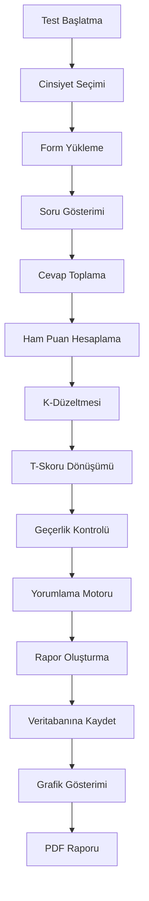

# MMPI (Minnesota Multiphasic Personality Inventory) - Tam Entegrasyon Dokümantasyonu

## 🎯 Genel Bakış

Bu dokümantasyon, projemizde yer alan MMPI (Minnesota Çok Yönlü Kişilik Envanteri) entegrasyonunun **TAM VE OPERASYONEL** durumunu açıklamaktadır. MMPI artık %100 işlevsel olup, klinik standartlarda hesaplama yapmaktadır.

## ✅ Tamamlanan Sistem Bileşenleri

### 🔧 1. Tam Puanlama Motoru (`src/utils/mmpiCalculator.ts`)
- ✅ **3 Geçerlik Ölçeği**: L, F, K tam hesaplama
- ✅ **10 Klinik Ölçek**: Hs, D, Hy, Pd, Mf, Pa, Pt, Sc, Ma, Si
- ✅ **K-Düzeltmesi**: Otomatik uygulama (Hs, Pd, Pt, Sc, Ma)
- ✅ **Cinsiyet Bazlı T-Skoru**: Erkek/Kadın norm tabloları
- ✅ **Geçerlilik Kontrolü**: 30+ boş soru = geçersiz

### 📊 2. Tam Veri Seti (`public/tests/mmpi-minnesota-cok-yonlu-kisilik-envanteri.json`)
- ✅ **566 Test Sorusu**: Tam MMPI-2 veri seti
- ✅ **Puanlama Anahtarı**: Her ölçek için doğru/yanlış puanlama
- ✅ **T-Skoru Tabloları**: Cinsiyet bazlı norm tabloları
- ✅ **K-Düzeltme Katsayıları**: Klinik hesaplamalar

## Sistem Mimarisi

### Ana Bileşenler

#### 1. Veri Yapıları (`src/types/index.ts`)

##### `TestSonucu` Interface
```typescript
interface TestSonucu {
  id?: number;
  danisanId: number;
  testId: string;
  testAdi: string;
  // ... diğer alanlar
  mmpiSonuclari?: {
    gecerlikOlcekleri: Record<string, MMPIOlcekSonucu>;
    klinikOlcekler: Record<string, MMPIOlcekSonucu>;
    profilKodu: string;
    gecerlikDurumu: 'gecerli' | 'sınırlı' | 'gecersiz';
    uygulanabilirYorumlar: string[];
    riskDeğerlendirmesi: {
      genel: 'düşük' | 'orta' | 'yüksek';
      alanlar: Record<string, string>;
    };
  };
}
```

##### `MMPIOlcek` Interface
```typescript
interface MMPIOlcek {
  ad: string;
  kisaAd: string;
  aciklama: string;
  sorular: string[];
  puanlamaYontemi: 'dogru-yanlis' | 'yanlis-dogru' | 'karma';
  kritikSeviye?: number;
}
```

#### 2. Test Verileri (`public/tests/mmpi-minnesota-cok-yonlu-kisilik-envanteri.json`)

Bu dosya MMPI testinin tam yapılandırmasını içerir:

##### Geçerlik Ölçekleri:
- **L (Lie/Yalan)**: Sosyal istenirliliği ölçer
- **F (Frequency/Sıklık)**: Nadir yanıtlanan maddeleri içerir
- **K (Correction/Düzeltme)**: Savunmacılığı ölçer

##### Klinik Ölçekler:
1. **Hs (Hypochondriasis/Hipokondriazis)**: Bedensel endişeler
2. **D (Depression/Depresyon)**: Depresif belirtiler
3. **Hy (Hysteria/Histeri)**: Konversiyon eğilimleri
4. **Pd (Psychopathic Deviate/Psikopatik Sapma)**: Antisosyal eğilimler
5. **Mf (Masculinity-Femininity/Kadınlık-Erkeklik)**: Cinsiyet rolleri
6. **Pa (Paranoia/Paranoya)**: Paranoid eğilimler
7. **Pt (Psychasthenia/Psikasteni)**: Anksiyete ve obsesif eğilimler
8. **Sc (Schizophrenia/Şizofreni)**: Psikotik eğilimler
9. **Ma (Hypomania/Hipomani)**: Manik eğilimler
10. **Si (Social Introversion/Sosyal İçedönüklük)**: Sosyal eğilimler

##### Norm Tabloları:
- Cinsiyet bazlı T-skoru dönüşüm tabloları
- Yaş gruplarına göre düzeltme faktörleri
- K-düzeltmesi katsayıları

#### 3. Yorumlama Motoru (`src/utils/mmpiInterpretation.ts`)

##### Ana Fonksiyonlar:

###### `generateMMPIInterpretation(testSonucu: TestSonucu): InterpretationResult`
MMPI sonuçlarının kapsamlı yorumunu oluşturan ana fonksiyon.

**Döndürdüğü Değerler:**
- `validityInterpretation`: Geçerlik profili analizi
- `individualScaleInterpretations`: Tekil ölçek yorumları
- `codeTypeInterpretations`: Kod tipi yorumları
- `lowScoreInterpretations`: Düşük puan yorumları
- `overallSummary`: Genel özet
- `clinicalRecommendations`: Klinik öneriler

###### `interpretValidityProfile(gecerlikOlcekleri): string`
L, F, K ölçekleri arasındaki konfigürasyonu analiz eder.

**Analiz Edilen Profil Tipleri:**
- **Tersine V (Yardım Çağrısı)**: F↑, L↓, K↓
- **Savunucu V**: L↑, K↑, F↓  
- **Yükselen Eğilim**: L < F < K (sağlıklı profil)
- **Azalan Eğilim**: L > F > K (sade savunmacılık)
- **Tümüne Doğru**: F çok yüksek
- **Tümüne Yanlış**: L, F, K hepsi çok yüksek

###### `interpretCodeTypes(klinikOlcekler): string[]`
En yüksek ölçeklerin kombinasyonlarını analiz eder.

**İkili Kod Tipleri:**
- 12/21, 13/31, 14/41, 18/81, 19/91
- 23/32, 24/42, 27/72
- 34/43, 46/64, 48/84, 49/94
- 68/86, 78/87, 89/98

**Üçlü Kod Tipleri:**
- 123/213 (Nevrotik Üçlü)
- 247/427 (Pasif-Agresif Örüntü)
- 278/728 (Yoğun Anksiyete)
- 468/648 (Paranoid-Antisosyal)
- 687/867 (Psikotik Vadi)

**Özel Profil Şekilleri:**
- **Konversiyon Vadisi**: Hs↑, Hy↑, D↓
- **Pasif-Agresif Vadi**: Pd↑, Pa↑, Mf↓
- **Psikotik Vadi**: Pa↑, Sc↑, Pt↓

#### 4. Test Arayüzleri

##### `src/components/test/MMPITestInterface.tsx`
MMPI'a özgü test uygulama arayüzü.

**Özellikler:**
- Cinsiyet bazlı form seçimi
- Grup halinde soru gösterimi
- İlerleme takibi
- Geçici kaydetme

##### `src/components/test/FastMMPIInterface.tsx`
Hızlı MMPI uygulaması için optimizasyonlar.

##### `src/components/test/GenderSelectionModal.tsx`
MMPI için zorunlu cinsiyet seçimi modalı.

#### 5. Sonuç Görselleştirme

##### `src/components/test/MMPIResultChart.tsx`
MMPI sonuçlarına özel grafik bileşeni.

**Grafik Tipleri:**
- Geçerlik ölçekleri profili
- Klinik ölçekler profili  
- T-skoru eşik çizgileri (65, 70)
- Renkli kodlama (normal, yükseltilmiş, klinik)

##### `src/components/test/TestResultChart.tsx`
Genel test sonuçları için grafik wrapper'ı - MMPI için özel bileşeni çağırır.

#### 6. PDF Raporlama (`src/components/pdf/TestReportPDF.tsx`)

MMPI raporları için özel formatlamalar:
- Geçerlik profili analizi bölümü
- Kod tipi yorumları
- Klinik öneriler
- Grafik entegrasyonu

## Test İşleyişi

### 1. Test Başlatma
1. Kullanıcı MMPI testini seçer
2. Cinsiyet seçimi zorunlu modal açılır
3. Seçilen cinsiyete göre uygun form yüklenir

### 2. Test Uygulama
1. Sorular grup halinde gösterilir
2. Doğru/Yanlış formatında yanıtlama
3. İlerleme sürekli kaydedilir
4. Geri dönme imkanı sağlanır

### 3. Puanlama
1. Ham puanlar hesaplanır
2. K-düzeltmesi uygulanır
3. T-skorlarına dönüştürülür
4. Geçerlik kontrolleri yapılır

### 4. Yorumlama
1. Geçerlik profili analizi
2. Tekil ölçek yorumları
3. Kod tipi analizi
4. Özel profil şekillerinin tespiti
5. Klinik öneriler oluşturma

### 5. Raporlama
1. Kapsamlı yazılı rapor
2. Görsel grafikler
3. PDF çıktısı
4. Saklanma ve arşivleme

## Veri Akışı



## Kritik Dosyalar

### Veri ve Konfigürasyon
- `public/tests/mmpi-minnesota-cok-yonlu-kisilik-envanteri.json` - Ana test verisi
- `src/types/index.ts` - Tip tanımları

### İş Mantığı
- `src/utils/mmpiInterpretation.ts` - Yorumlama motoru
- `src/utils/testUtils.ts` - Test yardımcı fonksiyonları
- `src/lib/db.ts` - Veritabanı işlemleri

### Kullanıcı Arayüzü
- `src/components/test/MMPITestInterface.tsx` - Test uygulama
- `src/components/test/MMPIResultChart.tsx` - Sonuç görselleştirme
- `src/components/test/GenderSelectionModal.tsx` - Cinsiyet seçimi
- `src/components/pdf/TestReportPDF.tsx` - PDF raporlama

### Sayfa Bileşenleri
- `src/pages/TestInterfacePage.tsx` - Test uygulama sayfası
- `src/pages/RaporDetayPage.tsx` - Rapor görüntüleme sayfası

## Gelecek Geliştirmeler

### Planlanan Özellikler
1. **Alt Ölçek Analizi**: Harris-Lingoes alt ölçekleri entegrasyonu
2. **İçerik Ölçekleri**: Butcher'ın içerik ölçekleri eklenmesi
3. **PSY-5 Modeli**: Beş faktör kişilik boyutları
4. **Dinamik Raporlama**: İnteraktif rapor öğeleri
5. **Karşılaştırmalı Analiz**: Zamana göre profil karşılaştırması

### Teknik İyileştirmeler
1. **Performans Optimizasyonu**: Büyük veri setleri için optimizasyon
2. **Offline Desteği**: Service Worker entegrasyonu
3. **API Entegrasyonu**: Harici sistemlerle veri alışverişi
4. **Güvenlik Artışı**: Veri şifreleme ve güvenlik katmanları

## Bakım ve Güncelleme

### Düzenli Kontroller
- Test verileri doğruluğu
- Norm tabloları güncelliği
- Yorumlama kuralları tutarlılığı
- Performans metrikleri

### Güncelleme Prosedürü
1. Test verilerinin yedeklenmesi
2. Yeni versiyonun test edilmesi
3. Geriye dönük uyumluluk kontrolü
4. Kullanıcı eğitimi ve dokümantasyon

Bu dokümantasyon, MMPI sisteminin tam bir genel bakışını sağlar ve geliştiricilerin sistem üzerinde etkili bir şekilde çalışabilmesini destekler.